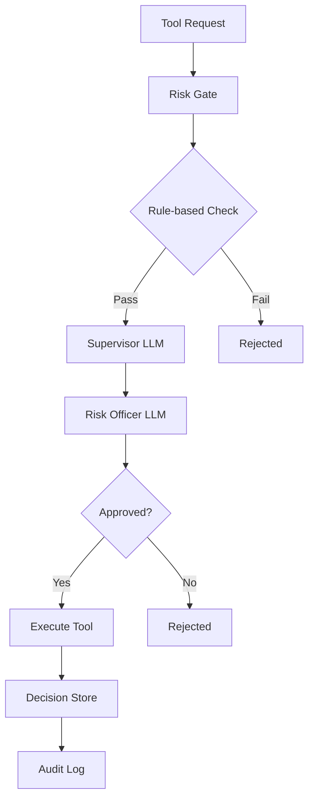

# MR BEN AI Agent System

## 🚀 Overview

The MR BEN AI Agent System provides GPT-5 integration with live trading control through a sophisticated risk gate architecture. This system enables AI-powered trading decisions while maintaining strict risk controls and audit trails.

## 🏗️ Architecture

### Core Components

```
src/agent/
├── __init__.py           # Package exports
├── schemas.py            # Pydantic schemas and data models
├── prompts.py            # Structured prompts for LLM evaluation
├── evaluators.py         # Supervisor and Risk Officer LLM evaluators
├── risk_gate.py          # Risk control and approval workflow
├── decision_store.py     # Decision tracking and storage
└── bridge.py             # Main integration bridge
```

### System Flow



## 🔧 Key Features

### 1. **Dual-Layer LLM Approval**
- **Supervisor**: Initial analysis and recommendation
- **Risk Officer**: Final approval with risk constraints
- Both use structured outputs with JSON schemas

### 2. **Risk Gate System**
- **Rule-based checks**: Daily loss limits, position limits, cooldowns
- **LLM evaluation**: Context-aware risk assessment
- **Emergency controls**: Automatic halt on threshold breaches

### 3. **Tool Management**
- **Read-only tools**: Market data, positions, metrics
- **Write-restricted tools**: Orders, risk limits (paper mode)
- **Full-access tools**: System control (live mode only)

### 4. **Decision Tracking**
- **JSONL storage**: Human-readable audit logs
- **Parquet storage**: Efficient querying and analysis
- **Real-time metrics**: Performance and risk monitoring

## 🚀 Quick Start

### 1. **Installation**

```bash
# Install dependencies
pip install pydantic openai

# Test the system
python test_agent.py
```

### 2. **Basic Usage**

```python
from src.agent.bridge import MRBENAgentBridge
from src.agent.schemas import TradingMode

# Configuration
config = {
    "model_name": "gpt-5",
    "temperature": 0.1,
    "risk_gate": {
        "max_daily_loss_percent": 2.0,
        "max_open_trades": 3
    }
}

# Initialize agent
with MRBENAgentBridge(config, TradingMode.OBSERVE) as agent:
    # Execute read-only tool
    result = agent.execute_tool(
        tool_name="get_market_snapshot",
        input_data={"symbol": "XAUUSD.PRO"},
        reasoning="Market analysis",
        risk_assessment="Low risk",
        expected_outcome="Current market data"
    )
    print(result)
```

### 3. **CLI Commands**

```bash
# Start agent in observe mode
python src/core/cli.py agent --mode observe --symbol XAUUSD.PRO

# Start agent in paper mode
python src/core/cli.py agent --mode paper --symbol XAUUSD.PRO

# Halt trading
python src/core/cli.py agent --halt

# Using Makefile
make agent          # Observe mode
make agent-paper    # Paper mode
make agent-halt     # Halt trading
```

## 🛠️ Tool Reference

### Read-Only Tools

| Tool | Description | Permission |
|------|-------------|------------|
| `get_market_snapshot` | Market data and indicators | Read-only |
| `get_positions` | Current open positions | Read-only |
| `get_open_orders` | Pending orders | Read-only |
| `get_config` | System configuration | Read-only |
| `get_metrics` | Performance metrics | Read-only |
| `quick_sim` | Trade simulation | Read-only |

### Write Tools (Restricted)

| Tool | Description | Risk Level | Approval Required |
|------|-------------|------------|-------------------|
| `place_order` | New trading order | Medium | Yes |
| `cancel_order` | Cancel existing order | Low | Yes |
| `set_risk_limits` | Risk parameters | High | Yes |

### System Control Tools

| Tool | Description | Risk Level | Approval Required |
|------|-------------|------------|-------------------|
| `halt_trading` | Stop all trading | Critical | Yes |
| `resume_trading` | Resume operations | High | Yes |

## 🔒 Risk Management

### Risk Levels

- **Low**: Read-only operations, order cancellation
- **Medium**: Standard trading operations
- **High**: Risk limit changes, system resumption
- **Critical**: Emergency halt, live mode activation

### Risk Controls

```python
# Risk gate configuration
risk_config = {
    "max_daily_loss_percent": 2.0,        # Maximum daily loss
    "max_open_trades": 3,                 # Maximum concurrent trades
    "max_position_size_usd": 10000.0,     # Maximum position size
    "max_risk_per_trade_percent": 1.0,    # Risk per trade
    "cooldown_after_loss_minutes": 30,    # Cooldown period
    "emergency_threshold_percent": 5.0    # Emergency halt threshold
}
```

### Approval Workflow

1. **Tool Request**: AI requests tool execution
2. **Rule Check**: Automatic risk rule validation
3. **Supervisor Review**: LLM analysis and recommendation
4. **Risk Officer Review**: Final approval with constraints
5. **Execution**: Tool execution with approved constraints
6. **Audit**: Decision stored and logged

## 📊 Decision Tracking

### Decision Storage

```python
# Get decision statistics
stats = agent.decision_store.get_decision_statistics()
print(f"Success Rate: {stats['success_rate']:.2%}")

# Search decisions
decisions = agent.search_decisions("market analysis", limit=10)

# Export decisions
export_path = agent.export_decisions("jsonl", filters={
    "tool_name": "place_order",
    "success": True
})
```

### Decision Schema

```python
{
    "decision_id": "uuid",
    "supervisor_decision": {
        "recommendation": "approve_with_constraints",
        "confidence": 0.85,
        "risk_level": "medium",
        "constraints": ["Position size limited to $5000"]
    },
    "risk_officer_decision": {
        "approval_status": "approved_with_constraints",
        "final_approval": true,
        "approved_constraints": ["Position size limited to $5000"]
    },
    "execution_result": {...},
    "success": true,
    "timestamp": "2025-08-14T..."
}
```

## 🔄 Trading Modes

### Observe Mode
- **Permissions**: Read-only tools only
- **Use Case**: Market analysis, system monitoring
- **Risk Level**: Minimal

### Paper Mode
- **Permissions**: Read-only + Write-restricted tools
- **Use Case**: Strategy testing, risk validation
- **Risk Level**: Low (no real money)

### Live Mode
- **Permissions**: All tools (with approval)
- **Use Case**: Live trading operations
- **Risk Level**: High (requires special approval)

## 🚨 Emergency Controls

### Automatic Halt Triggers

- Daily loss exceeds emergency threshold
- Risk level reaches critical
- System health issues detected

### Manual Halt

```python
# Emergency halt
agent.halt_trading("Market volatility spike", emergency=True)

# Resume trading
agent.resume_trading("Risk review completed")
```

## 📈 Performance Monitoring

### Metrics Collection

```python
# Get agent status
status = agent.get_agent_status()
print(f"Risk Level: {status['risk_gate_status']['risk_level']}")
print(f"Available Tools: {status['available_tools']}")

# Performance metrics
metrics = status['performance_metrics']
```

### Decision Analytics

```python
# Recent decisions
recent = agent.get_recent_decisions(hours=24, limit=50)

# Risk level breakdown
risk_breakdown = agent.decision_store.get_decision_statistics()
print(f"High Risk Decisions: {risk_breakdown['risk_level_breakdown']['high']}")
```

## 🔧 Configuration

### Agent Configuration

```yaml
# config/agent.yaml
model_name: "gpt-5"
temperature: 0.1
max_tokens: 4000
structured_output: true
risk_gate_enabled: true
approval_required: true

risk_gate:
  max_daily_loss_percent: 2.0
  max_open_trades: 3
  max_position_size_usd: 10000.0
  max_risk_per_trade_percent: 1.0
  cooldown_after_loss_minutes: 30
  emergency_threshold_percent: 5.0

decision_storage:
  storage_dir: "artifacts/decisions"
  max_memory_decisions: 1000
  enable_jsonl: true
  enable_parquet: true
```

### Environment Variables

```bash
# OpenAI Configuration
OPENAI_API_KEY=your_api_key_here
OPENAI_MODEL_NAME=gpt-5

# Risk Management
MAX_DAILY_LOSS_PERCENT=2.0
MAX_OPEN_TRADES=3
EMERGENCY_THRESHOLD_PERCENT=5.0

# Storage
DECISION_STORAGE_DIR=artifacts/decisions
ENABLE_PARQUET_STORAGE=true
```

## 🧪 Testing

### Run Tests

```bash
# Basic functionality test
python test_agent.py

# Using Makefile
make agent-workflow
```

### Test Coverage

- **Unit Tests**: Individual component testing
- **Integration Tests**: Component interaction testing
- **End-to-End Tests**: Full workflow validation

## 🚀 Advanced Usage

### Custom Tool Registration

```python
from src.agent.schemas import WriteToolSchema

# Register custom tool
custom_tool = WriteToolSchema(
    name="custom_strategy",
    description="Custom trading strategy",
    permission="write_restricted",
    risk_level="medium",
    max_impact_usd=5000.0
)

agent.tool_registry.register_tool(custom_tool)
```

### Custom Risk Rules

```python
# Extend risk gate with custom rules
class CustomRiskGate(RiskGate):
    def _custom_risk_check(self, tool, context):
        # Implement custom risk logic
        if tool.name == "custom_strategy":
            return self._check_custom_strategy_risk(context)
        return True, [], "Custom check passed"
```

### Integration with Trading System

```python
# Connect to existing trading system
from src.core.trader import MT5LiveTrader

class IntegratedAgentBridge(MRBENAgentBridge):
    def __init__(self, config, trading_mode, trader: MT5LiveTrader):
        super().__init__(config, trading_mode)
        self.trader = trader

    def execute_tool(self, tool_name, input_data, **kwargs):
        # Integrate with trader for actual execution
        if tool_name == "place_order":
            return self._execute_via_trader(input_data)
        return super().execute_tool(tool_name, input_data, **kwargs)
```

## 📚 API Reference

### MRBENAgentBridge

#### Methods

- `execute_tool(tool_name, input_data, **kwargs)`: Execute a tool
- `change_trading_mode(mode)`: Change trading mode
- `get_agent_status()`: Get current agent status
- `get_available_tools()`: List available tools
- `halt_trading(reason, emergency=False)`: Halt trading
- `resume_trading(reason)`: Resume trading
- `export_decisions(format, filters)`: Export decisions

#### Properties

- `agent_id`: Unique agent identifier
- `trading_mode`: Current trading mode
- `risk_gate`: Risk gate instance
- `decision_store`: Decision storage instance

### RiskGate

#### Methods

- `check_tool_permission(tool, mode, context)`: Check tool permission
- `request_tool_execution(**kwargs)`: Request tool execution
- `get_decision_status(decision_id)`: Get decision status
- `execute_approved_tool(decision_id)`: Execute approved tool

### DecisionStore

#### Methods

- `store_decision(decision)`: Store a decision
- `get_decision(decision_id)`: Get decision by ID
- `search_decisions(query, fields, limit)`: Search decisions
- `export_decisions(format, filepath, filters)`: Export decisions

## 🔮 Future Enhancements

### Planned Features

1. **Real-time Streaming**: WebSocket integration for live updates
2. **Advanced Risk Models**: ML-powered risk assessment
3. **Multi-Agent Coordination**: Multiple agents working together
4. **Cloud Integration**: AWS/GCP deployment support
5. **Advanced Analytics**: Real-time performance dashboards

### Extension Points

- **Custom Evaluators**: Domain-specific LLM evaluators
- **Risk Models**: Integration with external risk systems
- **Tool Ecosystem**: Plugin-based tool architecture
- **Audit Systems**: Advanced compliance and audit features

## 📞 Support

### Documentation

- **API Reference**: Complete method documentation
- **Examples**: Usage examples and patterns
- **Troubleshooting**: Common issues and solutions

### Community

- **GitHub Issues**: Bug reports and feature requests
- **Discussions**: Community support and ideas
- **Contributions**: Pull requests and improvements

---

**Status**: ✅ Production Ready
**Version**: 1.0.0
**Last Updated**: August 14, 2025
